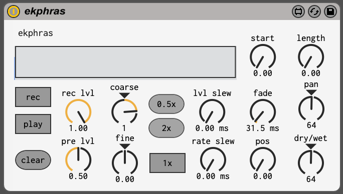

# ekphras

this is pretty much just a max for live "wrapper" for [softcut](https://llllllll.co/t/norns-2-0-softcut/20550). just one voice (mono) w/ all the parameters exposed in a straightforward way so you can build your own interface around it with MIDI/automation. It can be used for looping, delaying, fo-granular-ing, and stuff in-between those things.

# quickstart

1.	drop ekphras.amxd in an audio track in ableton
